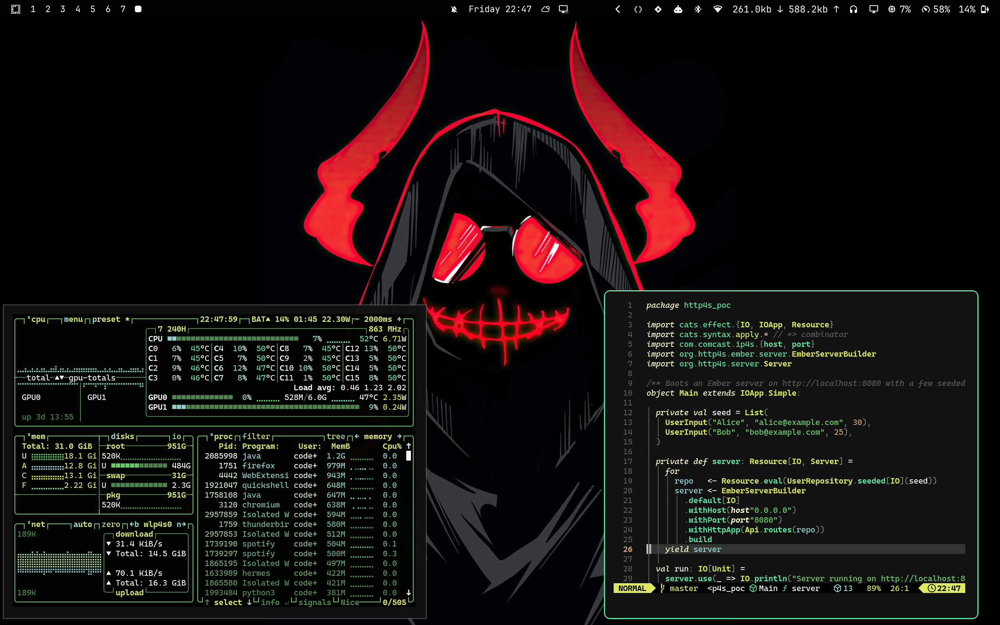

# Omarchy Elysian Matte Theme

[Elysian](https://github.com/bjarneo/omarchy-elysian-theme), untouched, except
for the terminals: Alacritty, Foot, Kitty and Ghostty use the softer
[Matte Black](https://github.com/basecamp/omarchy) colors (`#bebebe` text on
`#121212`).



## Installation

```bash
curl -fsSL https://raw.githubusercontent.com/codegik/omarchy-elysian-matte-theme/main/install.sh | bash
```

This clones the repo to `~/.local/share/omarchy-elysian-matte-theme`, links it
as `~/.config/omarchy/themes/elysian-matte` and applies it. Run it again to update.

Why not `omarchy theme install <url>`? For themes cloned from a repo, Omarchy
drops `neovim.lua` and the terminal configs and regenerates them from
`colors.toml`, so you'd get plain Elysian. A theme linked from your own clone
keeps every file.

## Files

| File | Source |
|------|--------|
| `colors.toml`, `neovim.lua`, `btop.theme`, `icons.theme`, `backgrounds/` | Elysian, unchanged |
| `alacritty.toml`, `foot.ini`, `kitty.conf`, `ghostty.conf` | Generated from Matte Black's palette |

## Credits

- Elysian theme by [Bjarne Oeverli](https://github.com/bjarneo/omarchy-elysian-theme)
- Matte Black palette from [Omarchy](https://github.com/basecamp/omarchy)
- Wallpapers belong to their respective artists (Steph Johnstone and others)
